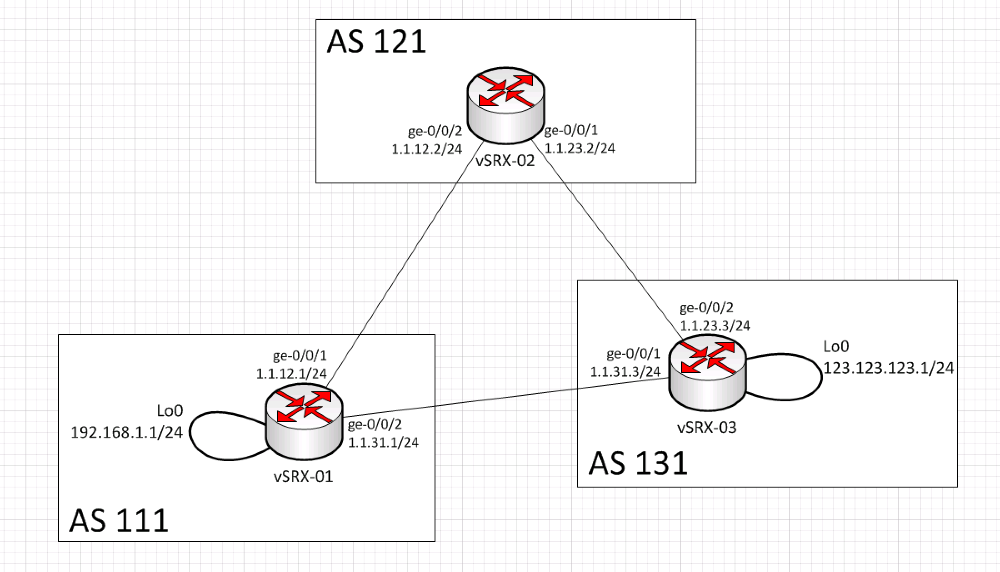

## Continuous Integration for Networking

###Matt Oswalt
###@Mierdin
###keepingitclassless.net

<!-- 

Started my career as a software developer, moved out of that into consulting for network and datacenter infrastructure for about 4 years, but now I'm back, and I'm currently obsessed with bridging the gap between these two seemingly separate silos.

Please feel free to ask questions at any time. I'll be covering a lot of different topics and I don't want to move past a topic that could use a little more detail. -->

---

# Disclaimer (ugh)

<!-- Just a disclaimer on what I'll be covering....in short, I work, this is not that. -->

Nothing in this presentation should be viewed to reflect any opinion or architectural detail of any employer, past or present. What I present is mine and mine alone. I do not disclose the details of any technology implementation without express permission, whether it is an employer (past or present) or a customer, or any other organization. 

Details provided should not be perceived to reflect the actual design or configuration of any specific real-world technology or infrastructure deployment, unless otherwise explicitly stated.

---

# Existing Network Challenges

- Manual changes inevitably lead to config drift
- Increased scale == greater chance and severity of problems
- RANCID is used SOMETIMES - really only a backup + diff

<!-- 

config drift could be between two employees, or between a human and software, or between sofware. Basically, the gap between WISB, and WIRI

if you look at how the webscale and hyperscale companies do network configuration, they rarely touch any network device directly.
This isn't just because of scale, it's a matter of discipline - applies to smaller shops too -->

---

# DevOps for Networks

<!-- 

At the heart of this idea, the business benefit is the same as "regular" devops - push more work through the pipeline, safely. So there really is no "network-centric" devops, or "devops for networks". We're all one big happy family.

We will be addressing many of these tenets in this presentation. 

-->

---

# The Community is Growing

<!-- I am not the only one doing this - the details of these methodolofies are being hashed out and tested RIGHT NOW, in the independent community. This movement is less about a product and more about the culture and the discipline.

Stay tuned to the end and I'll post links to other resources from other good people in the industry. -->

---

# Culture

- Culture is KEY; must have buy-in.
- Start simple. Hostnames, snmp, etc.
- Network Automation Meetup - Tyler Christiansen

<!-- There is not much point in embarking on the network automation journey if you're unable to get buy-in. 

Starting simple allows you to get easy wins early on by building the automation workflow but not touching anything that might impact production, while you sort it all out. Once that's stable, start adding in more advanced stuff.

Check out Tyler's post, my views are very similar to his.

-->

---

# Git

- Typically used for software projects but.....
- ....can version anything you want! Even binaries! (kind of)
- Relatively steep learning curve, but worth it.

---

# Gerrit

- Allows humans and robots alike to provide feedback on changes
- Could function as a basic change management system
- Unique approval workflow (vs PRs)

<!-- Gerrit can be.....finicky. Another very valid approach would be to replace Gerrit with something else, if you aren't married to Gerrit's style of approvals. Gitlab, github enterprise, etc. -->

---

# Jenkins

- Build Automation "Swiss Army Knife"
- Testing of changes to Gerrit repo
- Calling test scripts

<!-- If there is a main use case for Jenkins, it's to build maven projects, but you can use "freestyle projects" to do whatever you want. 

In our example, we're not even compiling any source code. We are just using Jenkins as a workflow engine.
-->

---

# Ansible

<!-- I'm going to assume that you have a basic understanding of Ansible, due to the previous presentations, but we will be using Ansible in a unique way to apply configurations to network devices. -->

- Simple, easy configuration management
- Builds templates
- Deploys config to routers via Juniper's modules

---

# Build Environment

<!--

I used this entire pipeline to create the JunOS lab, and I have uploaded everything to Github for you to see - definitely check that out.

Jenkins:
- ci networks-test-geo builds templates, basic sanity check
- ci-networks-run-geo deploys config
- Rollback if needed (future)

-->

---

# Demo Topology

<!-- here is the topology, please screenshot this now if you'd like -->

---

# Demo Outline

<!--

The way this demo is going to work - this is not going to be super formal - please please please interrupt me the moment I start going too fast and I'll be happy to go back over something.

-->

- 3x vSRX / BGP up but no adverts
- Need to advertise loopback on vSRX-03
- Need to ensure vSRX-01 sees at least this one route
- Need vSRX-01 to prefer path through vSRX-02

<!--

After reverting all files and running them, don't forget to remove the policies

Steps:
- show the CLI
- first do a tour of the files - first generally across the whole thing, then specifically on how the vars file and templates work.
- add logic to advertise network
    - fat finger the template on your first go-around, so you can amend the commit. Show this by running build locally, but push it anyways and show jenkins catching it
- modify unit test to look for certain networks (beginning should just be assert true)
- add logic to do as-path prepend

I am fairly new to JunOS, and as such am not yet taking full advantage of some of the features, automated rollback for instance. There are many things you can do beyond this demo, this demo is mostly just to get the creative juices flowing.

-->

---

# Resources

- Github Repo - http://github.com/Mierdin/ci-networks
- Original vSRX Demo
	- https://github.com/jeremyschulman/ansible-vsrx-demo
- Blogs
	- http://blog.tylerc.me/
	- http://keepingitclassless.net/
- Questions? - @Mierdin

